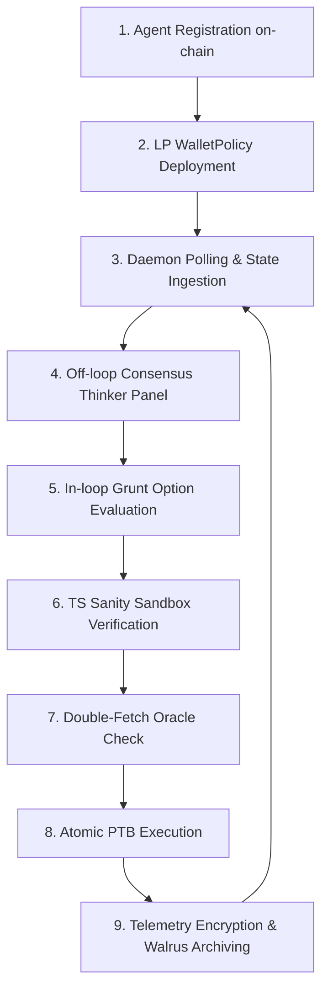

# AURA Agent Lifecycle & Consensus Architecture

This document provides a comprehensive analysis of the lifecycle, control flows, LLM interaction patterns, and economic design of autonomous agents within the AURA protocol.

---

## 1. Step-by-Step Execution Lifecycle

The operational path of an AURA agent transitions between on-chain Move enforcement, off-chain LLM cognitive loops, and decentralized storage archiving.



### Step 1: Registry On-Boarding (Registration)
*   **Trigger:** The operator runs `register_agent` via the operator daemon or dApp dashboard.
*   **On-Chain Action:** Calls `aura_registry::register_agent` on the Sui blockchain, locking a SUI performance stake bond (0.1 SUI on Testnet, or dynamically calculated on Mainnet).
*   **State Created:** An `AgentCap` is minted to the operator's key, and their agent address is registered with a Bayesian prior reputation score initialized to 50%.

### Step 2: Capital Delegation (Policy Wallet Deployment)
*   **Trigger:** A Liquidity Provider (LP) or the user deploys a dedicated sandbox wallet.
*   **On-Chain Action:** Instantiates `agent_wallet_policy::create_policy`, depositing trading capital (dUSDC) and delegating execution authority to the registered agent's address. Allowlisted packages (e.g. DeepBook Predict) and drawdown ceilings are set at this stage.

### Step 3: Off-Chain Daemon Cycle Initialization
*   **Trigger:** The daemon server is started (listening on port 3000).
*   **Action:** Hitting the "Start Agent/Server" button on the Cloud Operator panel transitions the server to an `ENABLED/RUNNING` state (which registers/bootstraps agent registry entities) but does **not** execute any periodic background cycles automatically. The trading loops or manual step execution are triggered strictly on-demand from the UI: via the per-agent "Run Loop" or "Step" buttons inside the Agent Directory tab, or via one-off atomic transactions triggered in the Intent Engine tab. Once triggered, manual or scheduled cycles poll the blockchain, pulling SVI base prices and volatility parameters from the DeepBook oracle object.

### Step 4: Asynchronous "Thinker Panel" Consensus (Every 5 Cycles)
*   **LLM Role:** **Thinkers** (`nemotron-3-ultra`, `qwen3-coder`, `llama-3.3-instruct`) act as judges.
*   **Flow:** The background consensus worker downloads the last 50 execution logs from Walrus. The three models evaluate historical PnL, drawdowns, and edge-case anomalies.
*   **Output:** They output a consensus strategy adjustment summary (e.g. *“Widening trade bands by 15% due to high net volatility mismatch; reduce default trade sizing by 25%.”*). This updates the system prompt of the active executor.

### Step 5: Grunt Option Evaluation (In-Loop)
*   **LLM Role:** **Grunt Executor** (`gemma-4-26b-a4b-it`).
*   **Flow:** Gemma is queried with the latest base price, SVI volatility surface parameters, and the strategic prompt synthesized by the Consensus Thinkers.
*   **Output:** Gemma evaluates options ranges and outputs a categorical decision: `WIDEN_SPREAD`, `MAINTAIN_SPREAD`, or `REDUCE_SIZE`.

### Step 6: TypeScript Sanity Sandbox Bounds Check
*   **Role:** Hardcoded mathematical safety wrapper.
*   **Flow:** The sandbox intercepts the Grunt's categorical decision. It maps it mathematically to actual options strike spreads and trade sizes (e.g., placing strikes at exactly $2.2$ standard deviations from spot).
*   **Guardrails:** If the Grunt tries to suggest an unsafe range or if confidence drops below 60%, the sandbox halts execution, logs a `LOGICAL_HALLUCINATION_CAUGHT` trace, and escalates to the HITL (Human-in-the-Loop) Inbox.

### Step 7: Double-Fetch Oracle Synchronization
*   **Role:** Stale-data prevention.
*   **Flow:** Immediately before signing, the client fetches the SVI oracle state again to verify that the off-chain calculations match the active on-chain block clock. If the parameters match, signature is broadcasted; if not, arguments are dynamically updated to prevent reverts.

### Step 8: Atomic Move Execution (PTB)
*   **On-Chain Action:** Executes a Programmable Transaction Block:
    1.  `borrow_for_trade` loans dUSDC from the policy and issues a hot-potato `TradeTicket`.
    2.  Move call triggers swap/mint option range on DeepBook Predict.
    3.  `return_and_complete` consumes the `TradeTicket` and returns remaining capital.
*   **Economic Fee:** If profitable, a 0.5% fee is automatically routed to `@buy_and_burn_insurance`.

### Step 9: Telemetry Timeline Archiving
*   **Action:** The daemon encrypts the raw reasoning traces client-side via Seal and archives the payload to Walrus. The generated `blob_id` is recorded, and a state compression string is pushed on-chain every 5 cycles to keep the live context window clean.

---

## 2. LLM-as-a-Judge Consensus Pattern

The AURA Consensus Thinker Panel is a production-grade implementation of the **LLM-as-a-Judge** framework, customized for autonomous financial risk management.

### The Mechanics
Rather than using a single model for both execution and evaluation, AURA isolates these tasks across a three-tier hierarchy to balance latency, cognitive reasoning, and safety:

1.  **The Grunt Executor (Gemma-4-26B):** 
    *   **Role:** Performs the active, in-loop translation from unstructured market inputs (SVI parameters, price, historical trends) into options range strategic intents (`WIDEN_SPREAD`, `MAINTAIN_SPREAD`, or `REDUCE_SIZE`).
    *   **Why it's not bloat:** The TypeScript Sandbox is a static mathematical wrapper; it cannot read high-level strategic summaries, analyze news sentiment, or dynamically adapt to qualitative parameters on its own. Gemma acts as the active "cognitive translator." It is lightweight, fast, and optimized for JSON structured outputs. Running Gemma at every block cycle keeps transaction latency low (<2s) while maintaining real-time adaptability.
2.  **The Judges / Thinker Panel (Nemotron, Qwen, Llama):**
    *   **Role:** Large-parameter judge models operating asynchronously (off-loop, every 5 cycles). They ingest historical timeline traces from Walrus and evaluate PnL, drawdowns, and systemic risk.
    *   **Cognitive Load Division:** Thinker models are too heavy, slow, and expensive to call on every block. Instead of deciding specific trades, they synthesize high-level strategic directives (e.g., *"Reduce exposure by 30% due to rising volatility"*), which are dynamically injected into Gemma's system prompts.
3.  **The TypeScript (TS) Sandbox:**
    *   **Role:** Deterministic mathematical guardrail. The sandbox does not *create* strategies; it only *constrains* them. It intercepts Gemma's structured output and maps it mathematically to actual strike calculations ($k \pm \sigma$). If Gemma attempts to execute an action that breaches maximum drawdown, balance floors, or safety boundaries, the Sandbox triggers a hard halt, logs a `LOGICAL_HALLUCINATION_CAUGHT` audit event, and escalates to the HITL (Human-in-the-Loop) inbox.

```text
  [ Raw Walrus History ] ──► Nemotron 3 Ultra  ──┐
                         ──► Qwen3 Coder       ──┼──► Synthesis Prompt ──► [ Gemma Grunt System Prompt ]
                         ──► Llama 3.3 Instruct ──┘
```

### Why a Trio?
A single LLM judge is prone to bias, formatting quirks, and idiosyncratic hallucinations. AURA uses a diverse trio to achieve consensus:
*   **NVIDIA Nemotron 3 Ultra:** Strong safety alignment and numerical classification.
*   **Qwen3 Coder:** Code reasoning, logic flow parsing, and structure evaluation.
*   **Meta Llama 3.3 Instruct:** Strong instruction-following and summary synthesis.

By running these three models in parallel and merging their evaluations, AURA filters out individual LLM variance and derives a stable, objective strategic directive.

---

## 3. Parameter Optimization & Decision Logic

Option range bounds are calculated using a hybrid model combining neural heuristic recommendations with deterministic mathematical formulas:

### The Mathematical Sandbox
1.  **Oracle Input:** The agent retrieves the SVI (Stochastic Volatility Inspired) parameters from the oracle:
    $$\theta_{SVI} = \{a, b, \rho, m, \sigma\}$$
2.  **Base Skew Calculation:** The volatility skew is computed across strike ranges:
    $$\sigma_{implied}(k) = \sqrt{a + b \left( \rho (k - m) + \sqrt{(k - m)^2 + \sigma^2} \right)}$$
3.  **Categorical Shift Application:**
    *   `WIDEN_SPREAD`: Widens the strike placement boundary to $k \pm 2.5 \sigma_{implied}$ to protect against high volatility.
    *   `MAINTAIN_SPREAD`: Retains standard boundaries at $k \pm 1.8 \sigma_{implied}$.
    *   `REDUCE_SIZE`: Reduces the trade size parameter by $50\%$ to mitigate exposure.
4.  **Drawdown Safety Factor:** If the agent logs a drawdown over the last 3 cycles, it automatically scales down trade size mathematically, regardless of LLM inputs, creating a programmatic circuit breaker.

---

## 4. Future Upgrades & Developer Resource Allocation

### How Compute and API Costs are Allocated
In AURA's decentralized network:
*   **The Shared Layer (On-Chain):** The Sui Move Registry and policies are shared. They store collateral stake, reputation, and allowlist rules.
*   **The Operator Layer (Off-Chain):** Developers host their own daemons (e.g. on Railway, AWS, or bare metal) and **pay for their own LLM API keys (OpenRouter/local compute)**.
*   **Incentive Alignment:** Operators do not pay the protocol for compute. Instead, they charge LPs a management/performance fee on delegated capital. The yield generated by their agents covers their server and LLM API costs, with the remainder acting as net profit.

### Planned Architecture Upgrades
For future iterations of the AURA protocol, the following upgrades are planned:

1.  **Fully On-Chain ZK-Auditing:**
    Instead of public/private decryption keys in dispute games, operators will generate Zero-Knowledge Proofs (using RISC Zero or SP1) proving that their off-chain LLM execution matched the allowlisted rules. This eliminates the 24-hour key disclosure window and resolves disputes instantly.
2.  **Move-Native Kiosk Royalty Enforcement:**
    Modify `agent_nft.move` to enforce on-chain royalty transfers directly in Move. When a high-performing agent NFT is sold or leased in a Sui Kiosk, the Move contract will programmatically route a percentage of all subsequent trading profits back to the original strategy creator's wallet.
3.  **Cross-Chain Paymaster Liquidity Pools:**
    Allow paymaster gas sponsorships to be funded using bridged assets (such as Ethereum USDC) via dynamic swaps, expanding the zkLogin onboarding reach to non-Sui native Web2 users.

---

## 5. Optimistic Slashing, Dispute Game, and Sybil Prevention

AURA implements an optimistic slashing game-theoretic model to enforce decentralized, honest agent behavior without relying on a centralized administrator or multi-sig keys.

### 5.1 How Challengers Detect Infractions
Challengers (and automated telemetry auditing bots) monitor the agent's behavior through three primary vectors:
1. **On-Chain Deviation:** Every trade executed by an agent is visible publicly on the Sui blockchain. Since the LP's `WalletPolicy` specifies strict rules (allowlisted packages, trading parameters, spot size limits), anyone can compare the transaction parameters against the allowlist rules. A transaction trading unapproved coins or exceeding the drawdown/size limits is an immediate indicator of a policy breach.
2. **Telemetry Gaps (Missing Blobs):** Agents must archive their step-by-step telemetry reasoning on Walrus and record the `blob_id` on-chain every cycle. If an agent stops publishing telemetry or posts unreachable/malformed `blob_id`s, it indicates a cover-up.
3. **Statistical Sampling (Spot Audits):** Auditors run regular spot-checks, choosing to audit random transaction blobs. 

### 5.2 The Dispute Game Steps
1. **File Challenge:** A challenger disputes a specific telemetry `blob_id` by calling `aura_registry::submit_dispute` and locking a **dispute bond** (0.01 SUI on Testnet / 50 SUI on Mainnet).
2. **Disclosure Window:** A 24-hour countdown begins on-chain. The operator of the challenged agent must call `aura_registry::disclose_telemetry_key` to publish the decryption key for that specific telemetry blob.
3. **Resolution Outcomes:**
   * **Outcome A: Operator fails to disclose key (Timeout Slash)**
     - If the 24-hour window expires, the operator is deemed malicious or dead.
     - Anyone can call `aura_registry::resolve_dispute`.
     - The registry contract slashes the agent operator's **entire performance stake** (0.1 SUI on Testnet / 500 SUI on Mainnet) and awards it to the challenger, along with a full refund of the challenger's dispute bond.
     - The agent is marked `inactive`, and its reputation score is reset to 0.
   * **Outcome B: Operator discloses decryption key (Cooperative Verification)**
     - The operator publishes the key, resolving the dispute.
     - The key is recorded on-chain, allowing anyone to decrypt the suspect telemetry blob off-chain using the browser dashboard (Audit Studio).
     - **Sybil Prevention & Privacy Compensation:** To prevent challengers from spamming disputes to force an operator to leak all their proprietary strategy logs for free, the challenger's dispute bond is **slashed and transferred to the agent operator**.
     - If the decrypted logs show the agent was **compliant** (false alarm), the challenger has paid a minor fee (0.01 SUI / 50 SUI) for the audit, and the operator is compensated for the privacy disclosure.
     - If the decrypted logs show the agent **breached rules** (infraction), the challenger submits the decrypted proof to the DAO/governance. The DAO slashes the operator's registry stake (0.1 SUI / 500 SUI) and transfers it to the challenger. This nets the challenger a **10x reward** (0.1 SUI bounty vs 0.01 SUI bond lost), ensuring strong incentives for honest auditors.

### 5.3 Game-Theoretic Payoff Matrix
The economics ensure that:
* Spammers/griefers lose their bonds to honest operators.
* Honest operators make net profits if spammed.
* Malicious operators are heavily penalized for non-disclosure or cheating.

| Case | Scenario | Operator Payoff | Challenger Payoff | System State |
| :--- | :--- | :--- | :--- | :--- |
| **1** | Challenger disputes compliant agent | +0.01 SUI (Compensated) | -0.01 SUI (Bond Slashed) | Compliant Agent remains Active |
| **2** | Challenger disputes cheating agent who hides key | -0.1 SUI (Stake Slashed) | +0.1 SUI (Bounty) | Agent deactivated |
| **3** | Challenger disputes cheating agent who discloses key | -0.1 SUI (DAO Slashed) | +0.09 SUI (Bounty minus bond) | Agent deactivated |
